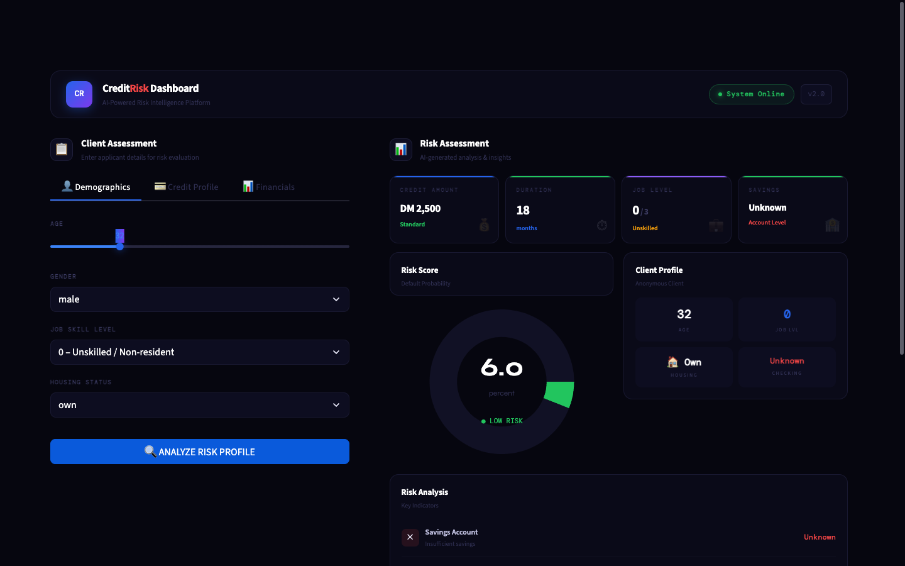

# CreditRisk Dashboard

AI-Powered Credit Risk Intelligence Platform built on the German Credit Dataset.



---

## Overview

This project trains a machine learning model to classify loan applicants as **Good** (low default risk) or **Bad** (high default risk), and exposes the model through a dark fintech-style Streamlit dashboard.

**Dataset:** German Credit Data (1,000 applicants, UCI Repository)
**Model:** Random Forest with SMOTE oversampling + GridSearchCV hyperparameter tuning
**Tech:** Python · scikit-learn · imbalanced-learn · Streamlit · Plotly

---

## Project Structure

```
ai-ml-capstone/
├── data/
│   └── german_credit_data.csv      # Raw dataset
├── models/
│   └── credit_risk_model_v2.pkl    # Trained model artifact
├── notebooks/
│   └── train_process.ipynb         # Exploratory analysis notebook
├── screenshots/
│   └── dashboard.png               # UI preview
├── src/
│   ├── __init__.py
│   ├── data.py                     # load_data() — CSV loading & cleaning
│   ├── preprocess.py               # build_preprocessor(), split_data()
│   ├── train.py                    # train_model(), evaluate_model()
│   └── predict.py                  # make_prediction() — inference helper
├── tests/
│   └── test_pipeline.py            # Unit tests (9 passing)
├── .streamlit/
│   └── config.toml                 # Dark theme configuration
├── app.py                          # Streamlit dashboard
├── run_training.py                 # Training pipeline orchestrator
└── requirements.txt
```

---

## Dashboard Features

| Panel | Description |
|---|---|
| **Navbar** | Live system status badge, version indicator |
| **Client Assessment** | Tabbed form — Demographics, Credit Profile, Financials |
| **KPI Cards** | Credit Amount · Duration · Job Level · Savings |
| **Risk Score** | Donut gauge showing default probability (green / amber / red) |
| **Client Profile** | At-a-glance stats grid |
| **Risk Analysis** | 3 key indicator checks with pass/fail signals |
| **Probability Scale** | Gradient bar with labelled percentage |
| **Recommendation** | AI-generated approve / decline assessment |

---

## Local Setup

Follow these steps to run the project on your machine from scratch.

### Prerequisites

- Python 3.9 or higher
- `pip` package manager
- Terminal / command prompt

### Step 1 — Clone the repository

```bash
git clone <your-repo-url>
cd ai-ml-capstone
```

### Step 2 — Create a virtual environment (recommended)

```bash
python3 -m venv venv
source venv/bin/activate        # macOS / Linux
# venv\Scripts\activate         # Windows
```

### Step 3 — Install dependencies

```bash
pip install -r requirements.txt
```

### Step 4 — Train the model

A pre-trained model (`models/credit_risk_model_v2.pkl`) is included. Skip this step unless you want to retrain from scratch.

```bash
python3 run_training.py
```

This runs the full pipeline: load → clean → split → SMOTE + GridSearchCV → evaluate → save. Expect 2–5 minutes depending on your machine.

### Step 5 — Launch the dashboard

```bash
streamlit run app.py
```

Streamlit will print a local URL — open it in your browser:

```
Local URL:  http://localhost:8501
```

### Step 6 — Run tests

```bash
python3 -m pytest tests/ -v
```

All 9 tests should pass in under 5 seconds.

---

## Model Performance

Trained with 5-fold cross-validated GridSearchCV optimising for **Recall** (minimising missed bad loans).

| Metric | Score |
|---|---|
| Accuracy | ~76% |
| ROC-AUC | ~80% |
| Optimiser | GridSearchCV (recall scoring) |
| Sampler | SMOTE (class imbalance correction) |

---

## Input Features

| Feature | Type | Description |
|---|---|---|
| Age | Numeric | Applicant age (18–80) |
| Sex | Categorical | male / female |
| Job | Ordinal | Skill level 0–3 |
| Housing | Categorical | own / free / rent |
| Saving accounts | Categorical | unknown / little / moderate / quite rich / rich |
| Checking account | Categorical | unknown / little / moderate / rich |
| Credit amount | Numeric | Loan amount in Deutsche Marks |
| Duration | Numeric | Loan term in months |
| Purpose | Categorical | car / education / business / etc. |
